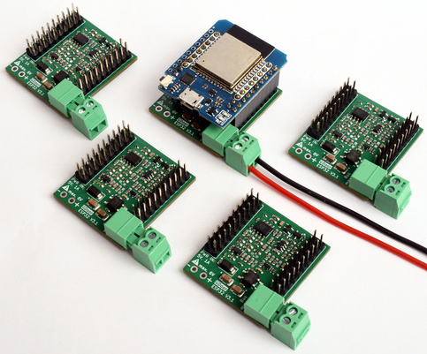

<h3>The GDoor hardware adapter allows the integration of a Gira TKS door bell system into a smart home.</h3>

GDoor is a project to collect and document findings about the Gira TKS Door System, all figured out by reverse engineering.
Gira is a german manufacturer of house appliances, including door systems. These systems are connected via a proprietary two wire bus system. 

The GDoor hardware adapter supports the following features:
- Interfacing the bus messages with your favorite home automation software via MQTT.
- Listening to the bus, e.g. to trigger notifications on mobile devices when a door bell button is pressed
- Sending to the bus, e.g. to open the door
- Support for HomeAssistant, openHAB and many more.

<a href="/buy.html">Buy</a>

<a href="/documentation/getting-started.html">Documentation</a>

<a href="/web-installer.html">Web Installer</a>

<a href="https://github.com/gdoor-org/gdoor">GitHub</a>

