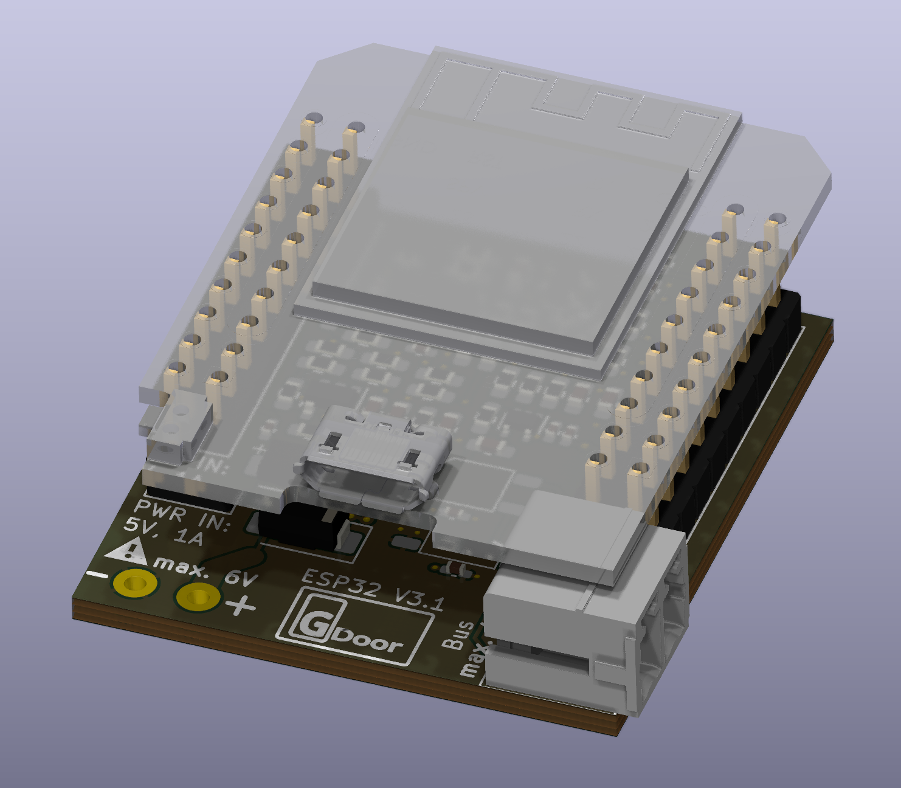

Gira is a german manufacturer of house appliances, including door systems. These systems are connected via a proprietary two wire bus system. GDOOR is a project to collect and document findings about the Gira Door System, all figured out by reverse engineering.

<c>

</c>

The GDOOR hardware adapter supports the following features:
- Interfacing the bus messages with your favourite home automation software via MQTT.
- Listening to the bus, e.g. to trigger notifications on mobile devices when a door bell button is pressed
- Sending to the bus, e.g. to open the door
- Support for HomeAssistent, Openhab and many more.
